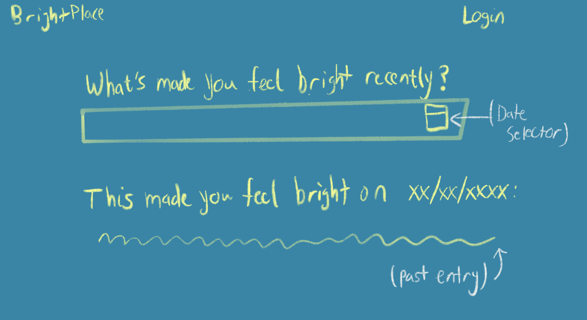

# BrighterSide

## "Always Look at the Brighter Side"
Pressure and negativity can oftentimes cause us to overlook the positives events in our lives. I know I struggle with this a lot, so I'm building a tool that can help track and remind myself of all the good that has and continues to happen in life. Hope this can be of use to some of you all as well :]

    
         <! -- width="1980" height="1080" border="10" --> 

## Want To Learn More?
Check out the [wiki](https://github.com/andrewpollack/brighter-side/wiki) to find a user guide, learn more about design decisions, as well as how to get started developing BrighterSide!

## Current Goals/Sprints
These are some established goals that I'm actively working on. Timeline may change as life gets busy or frees up, but it's always important to have goals!
1. Finish initial data structure
2. Sketch user flow outline
3. Establish initial DB choice / connection
4. Construct initial CRUD API for data entities
5. Test CRUD API using Postman
6. Connect Backend API to basic Frontend display

## /dev/ Log
### Sept 19th 2020

Currently laying out initial architecture and framework of the project. Will be updating Wiki with frameworks as they happen, and bound to change a ton during these early stages. Initial name of this project is BrighterSide (as in "Always look at the brighter side"), and I'm excited to start soon :D
